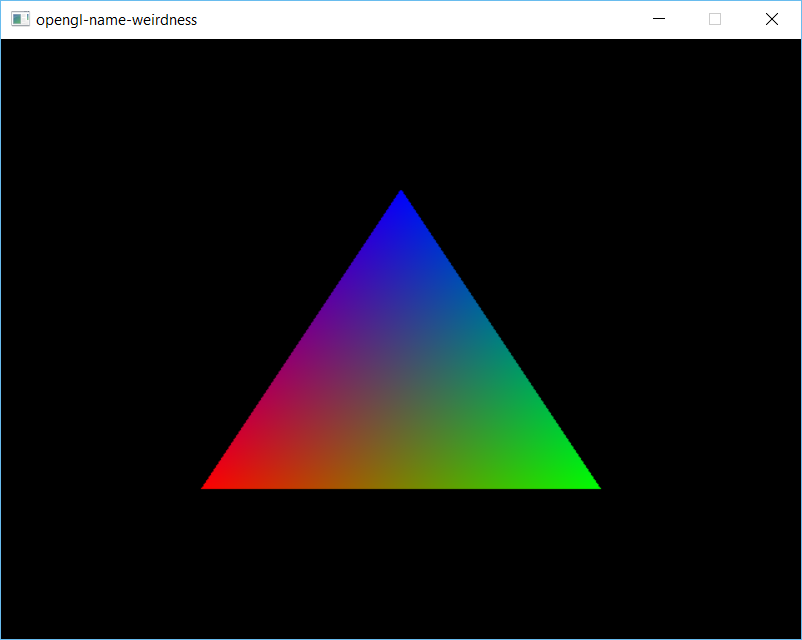

# opengl-name-weirdness

In compatibility mode, OpenGL names don't have to be returned from glGen*. You can use whatever you want, even a 32-bit address.

See [main.cpp](main.cpp) for an example of using random numbers as object names.

Result of running main.cpp:

